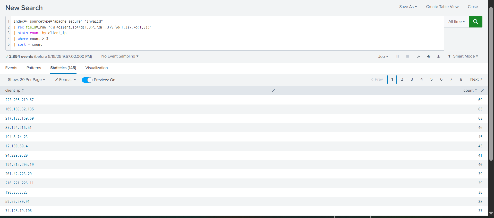

## Simulated Detection Rule: Brute Force Login Attempt - Apache

**Rule Logic:**  
- **Condition**: IP with more than 5 failed login attempts in under 1 minute  
- **Fields Monitored**: `client_ip`, `user`, `_time`

Visual Output:



IPs with suspicious failed login attempts

Indicates brute-force activity patterns

Note: Alert could not be configured due to license limitations in the Splunk Free version. In a production environment, this rule would be saved as a scheduled alert running every 5 minutes with a threshold > 0 results.

Action Plan:

Monitor affected IPs

Escalate repeated login attempts

Block IP if confirmed malicious

**Skills Demonstrated**
- SIEM use case development
- Regex-based field extraction
- Splunk SPL queries
- Brute force detection logic
- Security alert logic and triage planning

**SPL Used**:
```spl
index=* sourcetype="apache secure" "invalid"
| rex field=_raw "(?P<client_ip>\d{1,3}\.\d{1,3}\.\d{1,3}\.\d{1,3})"
| stats count by client_ip
| where count > 3
| sort - count


